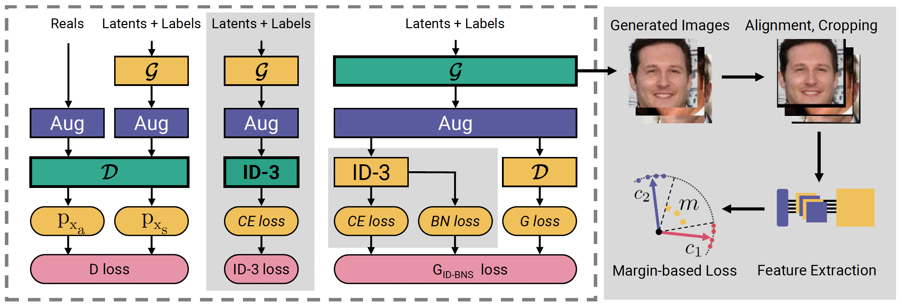

# Synthetic-Face-Recognition

## News
- Paper accepted at CVPRW 2023: Identity-driven Three-Player Generative Adversarial Network for Synthetic-based Face Recognition
- Paper accepted at Image and Vision Computing 2023: [Synthetic Data for Face Recognition: Current State and Future Prospects
](https://arxiv.org/abs/2305.01021)
 

### Identity-driven Three-Player Generative Adversarial Network for Synthetic-based Face Recognition
- Paper on [Arxiv](https://arxiv.org/abs/2305.00358)
- Code and pretrained model will be soon released

